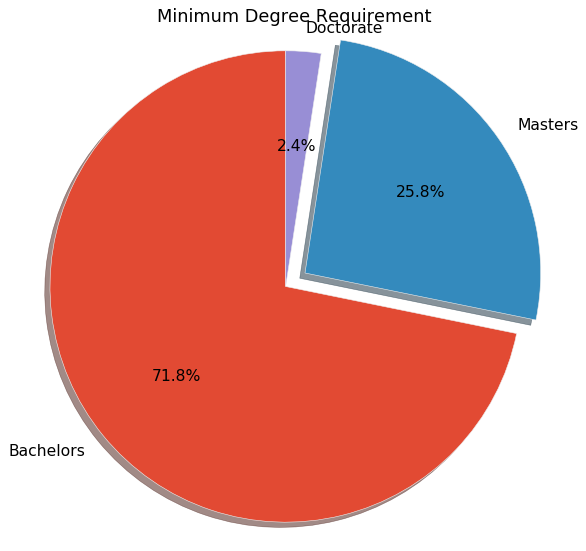

### Import Dependencies


```python
from collections import Counter
import pandas as pd
import numpy as np
import matplotlib.pyplot as plt
import re

file = "Resources/alldata.csv"
```


```python
# Read dataframe
df = pd.read_csv(file)
df.count()
```


    position       6953
    company        6953
    description    6953
    reviews        5326
    location       6953
    dtype: int64


```python
# Drop reviews column
del df['reviews']
```


```python
# Drop records where there are any NA
df=df.dropna(how='all')
df.count()
```


    position       6953
    company        6953
    description    6953
    location       6953
    dtype: int64


```python
# Create a clean location column
df['location'] = df['location'].str.replace(r'\d+','')
df['location'] = df['location'].str.strip()
# df
```


```python
# Running our 'query' through the position column, marking found words as true
try:
  df = df.rename(columns={"positiontxt":"position"})
  df['position'] = df[df['position'].str.contains('data|science|database|analytics|statistician|machine learning|business intelligence',
                                                  flags=re.IGNORECASE, regex=True)]
except AttributeError:
  print("stupid error makes no sense")

# df.count()
```


```python
df = df.dropna(how='any')
df['position']
```


    2                                          Data Scientist
    3                                            Data Analyst
    4       Assistant Professor -TT - Signal Processing & ...
    5                             Manager of Data Engineering
    9       Senior Associate - Cognitive Data Scientist Na...
    12                       Senior Associate, Data Scientist
    14      Business Intelligence Data Science Analyst - S...
    15                                         Data Scientist
    18                                         Data Scientist
    19                                         Data Scientist
    22                                         Data Scientist
    23                          DATA SCIENTIST - Supply Chain
    24                       Data Scientist, Keying & Linking
    25                                         Data Scientist
    26                   Data Scientist 1 – AP Forensics Team
    27                                   Data Scientist - ICL
    28                                 Data Scientist, Online
    29      Data Scientist - CONSULTANT Level - ORLANDO FL...
    30                                  Senior Data Scientist
    31      Business Intelligence Data Scientist - Supply ...
    33                              Scientist - Data Analysis
    34                                         Data Scientist
    35                                         Data Scientist
    36                                         Data Scientist
    38                                         Data Scientist
    39                    DATA SCIENTIST - SPACE OPTIMIZATION
    40      Data Science Specialist - Periscope, New Ventures
    41                                  Senior Data Scientist
    42                    Manager - Data Scientist ! Orlando!
    44                                    Lead Data Scientist
                                  ...                        
    6926               Lead Data Scientist - Machine Learning
    6927           Staff Data Scientist - Tech CA (TECH12458)
    6928                           Machine Learning Scientist
    6929              Data Scientist, Path Forward Returnship
    6930                                       Data Scientist
    6931         Data Scientist - Alexa Language Technologies
    6932                                       Data Scientist
    6933                                       Data Scientist
    6934    Data Scientist, Cloud Revenue Acceleration, Go...
    6935                             Data & Applied Scientist
    6936         Data Scientist - Alexa Language Technologies
    6937                        Data Scientist / Data Analyst
    6938    Data Scientist, Customer Interests & Personali...
    6939    Data Scientist, Customer Interests & Personali...
    6940                             Principal Data Scientist
    6941    Data Scientist, Engineering Support Analytics,...
    6943                                 Staff Data Scientist
    6944          Staff Data Scientist, Search/Online Grocery
    6945        Machine Learning Specialist, Trust and Safety
    6947                   Applied Machine Learning Scientist
    6949    Systems software Performance Data Scientist Su...
    6951                            Lead Data Scientist - NLP
    6953             Machine Learning Scientist, Amazon Alexa
    6955                                        Data Engineer
    6956                            Manager, Machine Learning
    6957                        Lead Data Scientist - Haskell
    6958                     Senior Data Scientist (GEC11902)
    6959            Data Developer / Machine Learning Analyst
    6962                      Senior Data & Applied Scientist
    6963              Principal Data Scientist, Deep Learning
    Name: position, Length: 2739, dtype: object


```python
# Cleaning & Formatting
newdf = df[['company', 'position']].copy()
newdf['Counts'] = df.groupby(['company'])['position'].transform('count')

newdfclean = newdf.drop(newdf[newdf.Counts < 33].index)
newdfclean
newdfclean.loc[df.position.str.contains('analyst', case=False), 'Job Type'] = 'Analyst'
newdfclean.loc[df.position.str.contains('analysis', case=False), 'Job Type'] = 'Analyst'
newdfclean.loc[df.position.str.contains('analytics', case=False), 'Job Type'] = 'Analyst'
newdfclean.loc[df.position.str.contains('machine learning', case=False), 'Job Type'] = 'Machine Learning'
newdfclean.loc[df.position.str.contains('engineering', case=False), 'Job Type'] = 'Engineer'
newdfclean.loc[df.position.str.contains('engineer', case=False), 'Job Type'] = 'Engineer'
newdfclean.loc[df.position.str.contains('data science', case=False), 'Job Type'] = 'Data Scientist'
newdfclean.loc[df.position.str.contains('data scientist', case=False), 'Job Type'] = 'Data Scientist'
newdfclean.loc[df.position.str.contains('applied scientist', case=False), 'Job Type'] = 'Data Scientist'
newdfclean.loc[df.position.str.contains('applied science', case=False), 'Job Type'] = 'Data Scientist'
newdfclean.loc[df.position.str.contains('sales', case=False), 'Job Type'] = 'Business Intelligence'
newdfclean.loc[df.position.str.contains('business intelligence', case=False), 'Job Type'] = 'Business Intelligence'

newdfclean.sort_values('Counts', ascending=False)
```
<table border="1" class="dataframe">
  <thead>
    <tr style="text-align: right;">
      <th></th>
      <th>company</th>
      <th>position</th>
      <th>Counts</th>
      <th>Job Type</th>
    </tr>
  </thead>
  <tbody>
    <tr>
      <th>3877</th>
      <td>Amazon.com</td>
      <td>Sr. Data Engineer</td>
      <td>157</td>
      <td>Engineer</td>
    </tr>
    <tr>
      <th>4979</th>
      <td>Amazon.com</td>
      <td>Data Scientist, Alexa Shopping NLU</td>
      <td>157</td>
      <td>Data Scientist</td>
    </tr>
    <tr>
      <th>5643</th>
      <td>Amazon.com</td>
      <td>Applied Science Manager - Deep Learning</td>
      <td>157</td>
      <td>Data Scientist</td>
    </tr>
    <tr>
      <th>5641</th>
      <td>Amazon.com</td>
      <td>Science Manager, Alexa Machine Learning</td>
      <td>157</td>
      <td>Machine Learning</td>
    </tr>
    <tr>
      <th>5638</th>
      <td>Amazon.com</td>
      <td>Sr Machine Learning Scientist - Prime Video Re...</td>
      <td>157</td>
      <td>Machine Learning</td>
    </tr>
    <tr>
      <th>5627</th>
      <td>Amazon.com</td>
      <td>Sr. Machine Learning Scientist, Amazon Alexa</td>
      <td>157</td>
      <td>Machine Learning</td>
    </tr>
    <tr>
      <th>5623</th>
      <td>Amazon.com</td>
      <td>Data Engineering Manager, Amazon Go</td>
      <td>157</td>
      <td>Engineer</td>
    </tr>
    <tr>
      <th>5620</th>
      <td>Amazon.com</td>
      <td>Senior Data Engineer</td>
      <td>157</td>
      <td>Engineer</td>
    </tr>
    <tr>
      <th>5615</th>
      <td>Amazon.com</td>
      <td>Sr Machine Learning Scientist - Prime Video Re...</td>
      <td>157</td>
      <td>Machine Learning</td>
    </tr>
    <tr>
      <th>4947</th>
      <td>Amazon.com</td>
      <td>Machine Learning Scientist</td>
      <td>157</td>
      <td>Machine Learning</td>
    </tr>
    <tr>
      <th>4971</th>
      <td>Amazon.com</td>
      <td>Manager, Data Science - Consumer Payments</td>
      <td>157</td>
      <td>Data Scientist</td>
    </tr>
    <tr>
      <th>4975</th>
      <td>Amazon.com</td>
      <td>Applied Scientist - Machine Learning</td>
      <td>157</td>
      <td>Data Scientist</td>
    </tr>
    <tr>
      <th>4978</th>
      <td>Amazon.com</td>
      <td>Data Scientist, Fire TV Product Management</td>
      <td>157</td>
      <td>Data Scientist</td>
    </tr>
    <tr>
      <th>4980</th>
      <td>Amazon.com</td>
      <td>Data Scientist, Private Label Apparel</td>
      <td>157</td>
      <td>Data Scientist</td>
    </tr>
    <tr>
      <th>5046</th>
      <td>Amazon.com</td>
      <td>Applied Scientist - Video Advertising (Data Sc...</td>
      <td>157</td>
      <td>Data Scientist</td>
    </tr>
    <tr>
      <th>4982</th>
      <td>Amazon.com</td>
      <td>AWS Americas Business Analytics &amp; Sales Insigh...</td>
      <td>157</td>
      <td>Business Intelligence</td>
    </tr>
    <tr>
      <th>4994</th>
      <td>Amazon.com</td>
      <td>Sr Machine Learning Engineer</td>
      <td>157</td>
      <td>Engineer</td>
    </tr>
    <tr>
      <th>5006</th>
      <td>Amazon.com</td>
      <td>Principal, Head of Machine Learning, Payment P...</td>
      <td>157</td>
      <td>Machine Learning</td>
    </tr>
    <tr>
      <th>5009</th>
      <td>Amazon.com</td>
      <td>Data Scientist - Delphi</td>
      <td>157</td>
      <td>Data Scientist</td>
    </tr>
    <tr>
      <th>5012</th>
      <td>Amazon.com</td>
      <td>Data Scientist</td>
      <td>157</td>
      <td>Data Scientist</td>
    </tr>
    <tr>
      <th>5015</th>
      <td>Amazon.com</td>
      <td>Applied Scientist - Personalization Data Sciences</td>
      <td>157</td>
      <td>Data Scientist</td>
    </tr>
    <tr>
      <th>5022</th>
      <td>Amazon.com</td>
      <td>Data Scientist, FBA fees</td>
      <td>157</td>
      <td>Data Scientist</td>
    </tr>
    <tr>
      <th>5023</th>
      <td>Amazon.com</td>
      <td>Data Scientist - Risk Mining</td>
      <td>157</td>
      <td>Data Scientist</td>
    </tr>
    <tr>
      <th>5025</th>
      <td>Amazon.com</td>
      <td>Data Scientist II - Payment Products</td>
      <td>157</td>
      <td>Data Scientist</td>
    </tr>
    <tr>
      <th>5041</th>
      <td>Amazon.com</td>
      <td>Data Scientist, Natural Language Processing (N...</td>
      <td>157</td>
      <td>Data Scientist</td>
    </tr>
    <tr>
      <th>5043</th>
      <td>Amazon.com</td>
      <td>Data Scientist - Amazon Business International</td>
      <td>157</td>
      <td>Data Scientist</td>
    </tr>
    <tr>
      <th>5648</th>
      <td>Amazon.com</td>
      <td>Software Development Engineer - Personalizatio...</td>
      <td>157</td>
      <td>Data Scientist</td>
    </tr>
    <tr>
      <th>5660</th>
      <td>Amazon.com</td>
      <td>Business Intelligence Manager</td>
      <td>157</td>
      <td>Business Intelligence</td>
    </tr>
    <tr>
      <th>5665</th>
      <td>Amazon.com</td>
      <td>Machine Learning Eng Amazon AI</td>
      <td>157</td>
      <td>Machine Learning</td>
    </tr>
    <tr>
      <th>5666</th>
      <td>Amazon.com</td>
      <td>Data Engineering Manager, Physical Stores</td>
      <td>157</td>
      <td>Engineer</td>
    </tr>
    <tr>
      <th>...</th>
      <td>...</td>
      <td>...</td>
      <td>...</td>
      <td>...</td>
    </tr>
    <tr>
      <th>2273</th>
      <td>Harnham</td>
      <td>Data Scientist, Marketing - Ecommerce</td>
      <td>33</td>
      <td>Data Scientist</td>
    </tr>
    <tr>
      <th>2248</th>
      <td>Harnham</td>
      <td>Data Scientist</td>
      <td>33</td>
      <td>Data Scientist</td>
    </tr>
    <tr>
      <th>2220</th>
      <td>Harnham</td>
      <td>Director, Digital Media Analytics</td>
      <td>33</td>
      <td>Analyst</td>
    </tr>
    <tr>
      <th>1269</th>
      <td>Harnham</td>
      <td>Senior Data Scientist - Global online company</td>
      <td>33</td>
      <td>Data Scientist</td>
    </tr>
    <tr>
      <th>1273</th>
      <td>Harnham</td>
      <td>Data Scientist</td>
      <td>33</td>
      <td>Data Scientist</td>
    </tr>
    <tr>
      <th>1203</th>
      <td>Harnham</td>
      <td>VP of Machine Learning</td>
      <td>33</td>
      <td>Machine Learning</td>
    </tr>
    <tr>
      <th>1919</th>
      <td>Harnham</td>
      <td>Senior Data Scientist</td>
      <td>33</td>
      <td>Data Scientist</td>
    </tr>
    <tr>
      <th>1319</th>
      <td>Harnham</td>
      <td>Senior Data Scientist</td>
      <td>33</td>
      <td>Data Scientist</td>
    </tr>
    <tr>
      <th>1312</th>
      <td>Harnham</td>
      <td>Principal Data Scientist</td>
      <td>33</td>
      <td>Data Scientist</td>
    </tr>
    <tr>
      <th>1282</th>
      <td>Harnham</td>
      <td>Data Scientist - AI Start-up</td>
      <td>33</td>
      <td>Data Scientist</td>
    </tr>
    <tr>
      <th>1104</th>
      <td>Harnham</td>
      <td>Machine Learning Engineer</td>
      <td>33</td>
      <td>Engineer</td>
    </tr>
    <tr>
      <th>3769</th>
      <td>Harnham</td>
      <td>Exciting Senior Data Scientist at Successful S...</td>
      <td>33</td>
      <td>Data Scientist</td>
    </tr>
    <tr>
      <th>5794</th>
      <td>Harnham</td>
      <td>Data Scientist - Global Retailer</td>
      <td>33</td>
      <td>Data Scientist</td>
    </tr>
    <tr>
      <th>5945</th>
      <td>Harnham</td>
      <td>Chief Data Scientist</td>
      <td>33</td>
      <td>Data Scientist</td>
    </tr>
    <tr>
      <th>6351</th>
      <td>Harnham</td>
      <td>DATA SCIENTIST-Predictive Modeling (Contract t...</td>
      <td>33</td>
      <td>Data Scientist</td>
    </tr>
    <tr>
      <th>6251</th>
      <td>Harnham</td>
      <td>Senior Data Scientist</td>
      <td>33</td>
      <td>Data Scientist</td>
    </tr>
    <tr>
      <th>6386</th>
      <td>Harnham</td>
      <td>Marketing Data Scientist - Contract to Hire</td>
      <td>33</td>
      <td>Data Scientist</td>
    </tr>
    <tr>
      <th>6414</th>
      <td>Harnham</td>
      <td>Data Scientist Lead - Remote Opportunity</td>
      <td>33</td>
      <td>Data Scientist</td>
    </tr>
    <tr>
      <th>6422</th>
      <td>Harnham</td>
      <td>Data Scientist - Marketing Analytics</td>
      <td>33</td>
      <td>Data Scientist</td>
    </tr>
    <tr>
      <th>6432</th>
      <td>Harnham</td>
      <td>Sr. Data Scientist REMOTE</td>
      <td>33</td>
      <td>Data Scientist</td>
    </tr>
    <tr>
      <th>6500</th>
      <td>Harnham</td>
      <td>Staff Data Scientist</td>
      <td>33</td>
      <td>Data Scientist</td>
    </tr>
    <tr>
      <th>6509</th>
      <td>Harnham</td>
      <td>Senior Deep Learning Data Scientist</td>
      <td>33</td>
      <td>Data Scientist</td>
    </tr>
    <tr>
      <th>6572</th>
      <td>Harnham</td>
      <td>Marketing Data Scientist</td>
      <td>33</td>
      <td>Data Scientist</td>
    </tr>
    <tr>
      <th>3986</th>
      <td>Harnham</td>
      <td>Lead Data Scientist, Hedge Fund</td>
      <td>33</td>
      <td>Data Scientist</td>
    </tr>
    <tr>
      <th>3855</th>
      <td>Harnham</td>
      <td>Machine Learning Engineer, Adtech</td>
      <td>33</td>
      <td>Engineer</td>
    </tr>
    <tr>
      <th>3835</th>
      <td>Harnham</td>
      <td>Lead Data Scientist - Aerospace</td>
      <td>33</td>
      <td>Data Scientist</td>
    </tr>
    <tr>
      <th>3818</th>
      <td>Harnham</td>
      <td>Senior Data Scientist, Healthcare</td>
      <td>33</td>
      <td>Data Scientist</td>
    </tr>
    <tr>
      <th>3784</th>
      <td>Harnham</td>
      <td>Adtech Senior Data Scientist</td>
      <td>33</td>
      <td>Data Scientist</td>
    </tr>
    <tr>
      <th>6313</th>
      <td>Harnham</td>
      <td>Principal Data Scientist</td>
      <td>33</td>
      <td>Data Scientist</td>
    </tr>
    <tr>
      <th>6300</th>
      <td>Harnham</td>
      <td>Data Scientist, Marketing - Retail</td>
      <td>33</td>
      <td>Data Scientist</td>
    </tr>
  </tbody>
</table>
<p>378 rows × 4 columns</p>
</div>


```python
print(plt.style.available)
```

    ['seaborn-dark', 'seaborn-darkgrid', 'seaborn-ticks', 'fivethirtyeight', 'seaborn-whitegrid', 'classic', '_classic_test', 'fast', 'seaborn-talk', 'seaborn-dark-palette', 'seaborn-bright', 'seaborn-pastel', 'grayscale', 'seaborn-notebook', 'ggplot', 'seaborn-colorblind', 'seaborn-muted', 'seaborn', 'Solarize_Light2', 'seaborn-paper', 'bmh', 'tableau-colorblind10', 'seaborn-white', 'dark_background', 'seaborn-poster', 'seaborn-deep']


```python
# Charting a graph for the job types at top companies
plt.style.use('ggplot')
plt.rcParams.update({'font.size': 15})
plt.cm.BuPu(np.linspace(0, 0.5))
bplot= newdfclean.groupby(['company', 'Job Type']).size().unstack()

bplot.plot(kind='bar',stacked=True, figsize=(20,12), title="Who are the top companies looking for?")

plt.savefig('Images/topcompanyjobs.png')
```


```python
# Get the state
state = df["location"].str.split(",", n = 1, expand = True)
df['state'] = state[1]
df.head()
```
<table border="1" class="dataframe">
  <thead>
    <tr style="text-align: right;">
      <th></th>
      <th>position</th>
      <th>company</th>
      <th>description</th>
      <th>location</th>
      <th>state</th>
    </tr>
  </thead>
  <tbody>
    <tr>
      <th>2</th>
      <td>Data Scientist</td>
      <td>Xpert Staffing</td>
      <td>Growing company located in the Atlanta, GA are...</td>
      <td>Atlanta, GA</td>
      <td>GA</td>
    </tr>
    <tr>
      <th>3</th>
      <td>Data Analyst</td>
      <td>Operation HOPE</td>
      <td>DEPARTMENT: Program OperationsPOSITION LOCATIO...</td>
      <td>Atlanta, GA</td>
      <td>GA</td>
    </tr>
    <tr>
      <th>4</th>
      <td>Assistant Professor -TT - Signal Processing &amp; ...</td>
      <td>Emory University</td>
      <td>DESCRIPTION\nThe Emory University Department o...</td>
      <td>Atlanta, GA</td>
      <td>GA</td>
    </tr>
    <tr>
      <th>5</th>
      <td>Manager of Data Engineering</td>
      <td>McKinsey &amp; Company</td>
      <td>Qualifications\nBachelor’s degree in Computer ...</td>
      <td>Atlanta, GA</td>
      <td>GA</td>
    </tr>
    <tr>
      <th>9</th>
      <td>Senior Associate - Cognitive Data Scientist Na...</td>
      <td>KPMG</td>
      <td>Known for being a great place to work and buil...</td>
      <td>Atlanta, GA</td>
      <td>GA</td>
    </tr>
  </tbody>
</table>
</div>


### Dependencies to use the Google API for heatmaps


```python
import requests
import json
import gmaps
from config import gkey
gmaps.configure(api_key=gkey)
```


```python
# Create a new df with only the distinct locations and include a column for longitude and latitude
distinct_locations_df = df[["location","state"]]
distinct_locations_df["longitude"]=""
distinct_locations_df["latitude"]=""
distinct_locations_df = distinct_locations_df.drop_duplicates(keep='first', inplace=False)
distinct_locations_df
```

<table border="1" class="dataframe">
  <thead>
    <tr style="text-align: right;">
      <th></th>
      <th>location</th>
      <th>state</th>
      <th>longitude</th>
      <th>latitude</th>
    </tr>
  </thead>
  <tbody>
    <tr>
      <th>2</th>
      <td>Atlanta, GA</td>
      <td>GA</td>
      <td></td>
      <td></td>
    </tr>
    <tr>
      <th>270</th>
      <td>Austin, TX</td>
      <td>TX</td>
      <td></td>
      <td></td>
    </tr>
    <tr>
      <th>281</th>
      <td>Round Rock, TX</td>
      <td>TX</td>
      <td></td>
      <td></td>
    </tr>
    <tr>
      <th>493</th>
      <td>Boulder, CO</td>
      <td>CO</td>
      <td></td>
      <td></td>
    </tr>
    <tr>
      <th>744</th>
      <td>Boston, MA</td>
      <td>MA</td>
      <td></td>
      <td></td>
    </tr>
    <tr>
      <th>1371</th>
      <td>Chicago, IL</td>
      <td>IL</td>
      <td></td>
      <td></td>
    </tr>
    <tr>
      <th>1842</th>
      <td>Washington, DC</td>
      <td>DC</td>
      <td></td>
      <td></td>
    </tr>
    <tr>
      <th>2189</th>
      <td>Los Angeles, CA</td>
      <td>CA</td>
      <td></td>
      <td></td>
    </tr>
    <tr>
      <th>2438</th>
      <td>Cambridge, MA</td>
      <td>MA</td>
      <td></td>
      <td></td>
    </tr>
    <tr>
      <th>3131</th>
      <td>Mountain View, CA</td>
      <td>CA</td>
      <td></td>
      <td></td>
    </tr>
    <tr>
      <th>3409</th>
      <td>New York, NY</td>
      <td>NY</td>
      <td></td>
      <td></td>
    </tr>
    <tr>
      <th>3412</th>
      <td>Jersey City, NJ</td>
      <td>NJ</td>
      <td></td>
      <td></td>
    </tr>
    <tr>
      <th>3417</th>
      <td>Manhattan, NY</td>
      <td>NY</td>
      <td></td>
      <td></td>
    </tr>
    <tr>
      <th>3422</th>
      <td>Newark, NJ</td>
      <td>NJ</td>
      <td></td>
      <td></td>
    </tr>
    <tr>
      <th>3481</th>
      <td>Hoboken, NJ</td>
      <td>NJ</td>
      <td></td>
      <td></td>
    </tr>
    <tr>
      <th>3489</th>
      <td>Brooklyn, NY</td>
      <td>NY</td>
      <td></td>
      <td></td>
    </tr>
    <tr>
      <th>3514</th>
      <td>Rutherford, NJ</td>
      <td>NJ</td>
      <td></td>
      <td></td>
    </tr>
    <tr>
      <th>3516</th>
      <td>Union, NJ</td>
      <td>NJ</td>
      <td></td>
      <td></td>
    </tr>
    <tr>
      <th>3549</th>
      <td>Rahway, NJ</td>
      <td>NJ</td>
      <td></td>
      <td></td>
    </tr>
    <tr>
      <th>3577</th>
      <td>Murray Hill, NJ</td>
      <td>NJ</td>
      <td></td>
      <td></td>
    </tr>
    <tr>
      <th>3653</th>
      <td>Troy Hills, NJ</td>
      <td>NJ</td>
      <td></td>
      <td></td>
    </tr>
    <tr>
      <th>3729</th>
      <td>Queens, NY</td>
      <td>NY</td>
      <td></td>
      <td></td>
    </tr>
    <tr>
      <th>3863</th>
      <td>Fort Lee, NJ</td>
      <td>NJ</td>
      <td></td>
      <td></td>
    </tr>
    <tr>
      <th>3909</th>
      <td>Parsippany, NJ</td>
      <td>NJ</td>
      <td></td>
      <td></td>
    </tr>
    <tr>
      <th>3938</th>
      <td>Roseland, NJ</td>
      <td>NJ</td>
      <td></td>
      <td></td>
    </tr>
    <tr>
      <th>4014</th>
      <td>Long Beach, NY</td>
      <td>NY</td>
      <td></td>
      <td></td>
    </tr>
    <tr>
      <th>4035</th>
      <td>Whippany, NJ</td>
      <td>NJ</td>
      <td></td>
      <td></td>
    </tr>
    <tr>
      <th>4205</th>
      <td>New Hyde Park, NY</td>
      <td>NY</td>
      <td></td>
      <td></td>
    </tr>
    <tr>
      <th>4215</th>
      <td>Secaucus, NJ</td>
      <td>NJ</td>
      <td></td>
      <td></td>
    </tr>
    <tr>
      <th>4292</th>
      <td>Port Washington, NY</td>
      <td>NY</td>
      <td></td>
      <td></td>
    </tr>
    <tr>
      <th>4311</th>
      <td>Short Hills, NJ</td>
      <td>NJ</td>
      <td></td>
      <td></td>
    </tr>
    <tr>
      <th>4328</th>
      <td>Woodcliff Lake, NJ</td>
      <td>NJ</td>
      <td></td>
      <td></td>
    </tr>
    <tr>
      <th>4396</th>
      <td>Redmond, WA</td>
      <td>WA</td>
      <td></td>
      <td></td>
    </tr>
    <tr>
      <th>4555</th>
      <td>San Diego, CA</td>
      <td>CA</td>
      <td></td>
      <td></td>
    </tr>
    <tr>
      <th>4968</th>
      <td>Seattle, WA</td>
      <td>WA</td>
      <td></td>
      <td></td>
    </tr>
    <tr>
      <th>5753</th>
      <td>San Francisco, CA</td>
      <td>CA</td>
      <td></td>
      <td></td>
    </tr>
    <tr>
      <th>5754</th>
      <td>Redwood City, CA</td>
      <td>CA</td>
      <td></td>
      <td></td>
    </tr>
    <tr>
      <th>5768</th>
      <td>San Mateo, CA</td>
      <td>CA</td>
      <td></td>
      <td></td>
    </tr>
    <tr>
      <th>5782</th>
      <td>Menlo Park, CA</td>
      <td>CA</td>
      <td></td>
      <td></td>
    </tr>
    <tr>
      <th>5793</th>
      <td>Foster City, CA</td>
      <td>CA</td>
      <td></td>
      <td></td>
    </tr>
    <tr>
      <th>5794</th>
      <td>Oakland, CA</td>
      <td>CA</td>
      <td></td>
      <td></td>
    </tr>
    <tr>
      <th>5805</th>
      <td>Berkeley, CA</td>
      <td>CA</td>
      <td></td>
      <td></td>
    </tr>
    <tr>
      <th>5809</th>
      <td>San Francisco Bay Area, CA</td>
      <td>CA</td>
      <td></td>
      <td></td>
    </tr>
    <tr>
      <th>5850</th>
      <td>Emeryville, CA</td>
      <td>CA</td>
      <td></td>
      <td></td>
    </tr>
    <tr>
      <th>5868</th>
      <td>South San Francisco, CA</td>
      <td>CA</td>
      <td></td>
      <td></td>
    </tr>
    <tr>
      <th>5878</th>
      <td>San Carlos, CA</td>
      <td>CA</td>
      <td></td>
      <td></td>
    </tr>
    <tr>
      <th>5899</th>
      <td>Union City, CA</td>
      <td>CA</td>
      <td></td>
      <td></td>
    </tr>
    <tr>
      <th>5902</th>
      <td>Burlingame, CA</td>
      <td>CA</td>
      <td></td>
      <td></td>
    </tr>
    <tr>
      <th>5906</th>
      <td>Belmont, CA</td>
      <td>CA</td>
      <td></td>
      <td></td>
    </tr>
    <tr>
      <th>5918</th>
      <td>Richmond, CA</td>
      <td>CA</td>
      <td></td>
      <td></td>
    </tr>
    <tr>
      <th>6049</th>
      <td>San Bruno, CA</td>
      <td>CA</td>
      <td></td>
      <td></td>
    </tr>
    <tr>
      <th>6143</th>
      <td>San Ramon, CA</td>
      <td>CA</td>
      <td></td>
      <td></td>
    </tr>
    <tr>
      <th>6235</th>
      <td>Alameda, CA</td>
      <td>CA</td>
      <td></td>
      <td></td>
    </tr>
    <tr>
      <th>6277</th>
      <td>Daly City, CA</td>
      <td>CA</td>
      <td></td>
      <td></td>
    </tr>
    <tr>
      <th>6292</th>
      <td>Mill Valley, CA</td>
      <td>CA</td>
      <td></td>
      <td></td>
    </tr>
    <tr>
      <th>6525</th>
      <td>Kentfield, CA</td>
      <td>CA</td>
      <td></td>
      <td></td>
    </tr>
    <tr>
      <th>6646</th>
      <td>Walnut Creek, CA</td>
      <td>CA</td>
      <td></td>
      <td></td>
    </tr>
    <tr>
      <th>6678</th>
      <td>Hayward, CA</td>
      <td>CA</td>
      <td></td>
      <td></td>
    </tr>
    <tr>
      <th>6708</th>
      <td>Sunnyvale, CA</td>
      <td>CA</td>
      <td></td>
      <td></td>
    </tr>
  </tbody>
</table>
</div>


```python
# Iterate through the distinct locations dataframe and get the longitude and latitude
# After getting the long and lat, add to the DF
for index, row in distinct_locations_df.iterrows():
    target_city_full = row["location"]
    target_city = target_city_full.split(",")[0]
    if (" " in target_city):
        target_city = target_city.replace(" ", "+")
    
    # Build the endpoint URL
    target_url = ('https://maps.googleapis.com/maps/api/geocode/json?'
    'address={0}&key={1}').format(target_city, gkey)
    geo_data = requests.get(target_url).json()
    
    try:
        distinct_locations_df.loc[index, 'latitude'] = geo_data["results"][0]["geometry"]["location"]["lat"]
        distinct_locations_df.loc[index, 'longitude'] = geo_data["results"][0]["geometry"]["location"]["lng"]
    except (KeyError, IndexError):
        print("Missing field/result... skipping.")
        
```


```python
# Get the number of times a location popped up (using the original dataframe
# Create a new column in the distinct locations dataframe for number of instances
distinct_locations_df["Number of Job Postings"] = df.groupby(["location"])['location'].transform('count')

# Delete empty rows
non_empty_rows = distinct_locations_df["longitude"] != ""
distinct_locations_df = distinct_locations_df[non_empty_rows]

# Delete rows with incorrect longitude values
distinct_locations_df = distinct_locations_df[(distinct_locations_df['longitude'] > -90) & (distinct_locations_df['longitude'] < 90)]

distinct_locations_df
```
<table border="1" class="dataframe">
  <thead>
    <tr style="text-align: right;">
      <th></th>
      <th>location</th>
      <th>state</th>
      <th>longitude</th>
      <th>latitude</th>
      <th>Number of Job Postings</th>
    </tr>
  </thead>
  <tbody>
    <tr>
      <th>2</th>
      <td>Atlanta, GA</td>
      <td>GA</td>
      <td>-84.388</td>
      <td>33.749</td>
      <td>108</td>
    </tr>
    <tr>
      <th>744</th>
      <td>Boston, MA</td>
      <td>MA</td>
      <td>-71.0589</td>
      <td>42.3601</td>
      <td>227</td>
    </tr>
    <tr>
      <th>1371</th>
      <td>Chicago, IL</td>
      <td>IL</td>
      <td>-87.6298</td>
      <td>41.8781</td>
      <td>204</td>
    </tr>
    <tr>
      <th>2438</th>
      <td>Cambridge, MA</td>
      <td>MA</td>
      <td>0.121817</td>
      <td>52.2053</td>
      <td>134</td>
    </tr>
    <tr>
      <th>3409</th>
      <td>New York, NY</td>
      <td>NY</td>
      <td>-74.006</td>
      <td>40.7128</td>
      <td>504</td>
    </tr>
    <tr>
      <th>3412</th>
      <td>Jersey City, NJ</td>
      <td>NJ</td>
      <td>-74.0431</td>
      <td>40.7178</td>
      <td>14</td>
    </tr>
    <tr>
      <th>3417</th>
      <td>Manhattan, NY</td>
      <td>NY</td>
      <td>-73.9712</td>
      <td>40.7831</td>
      <td>12</td>
    </tr>
    <tr>
      <th>3422</th>
      <td>Newark, NJ</td>
      <td>NJ</td>
      <td>-74.1724</td>
      <td>40.7357</td>
      <td>4</td>
    </tr>
    <tr>
      <th>3481</th>
      <td>Hoboken, NJ</td>
      <td>NJ</td>
      <td>-74.0324</td>
      <td>40.744</td>
      <td>1</td>
    </tr>
    <tr>
      <th>3489</th>
      <td>Brooklyn, NY</td>
      <td>NY</td>
      <td>-73.9442</td>
      <td>40.6782</td>
      <td>7</td>
    </tr>
    <tr>
      <th>3514</th>
      <td>Rutherford, NJ</td>
      <td>NJ</td>
      <td>-74.1068</td>
      <td>40.8265</td>
      <td>1</td>
    </tr>
    <tr>
      <th>3549</th>
      <td>Rahway, NJ</td>
      <td>NJ</td>
      <td>-74.2776</td>
      <td>40.6082</td>
      <td>2</td>
    </tr>
    <tr>
      <th>3577</th>
      <td>Murray Hill, NJ</td>
      <td>NJ</td>
      <td>-73.9757</td>
      <td>40.7479</td>
      <td>4</td>
    </tr>
    <tr>
      <th>3653</th>
      <td>Troy Hills, NJ</td>
      <td>NJ</td>
      <td>-74.3921</td>
      <td>40.8529</td>
      <td>1</td>
    </tr>
    <tr>
      <th>3729</th>
      <td>Queens, NY</td>
      <td>NY</td>
      <td>-73.7949</td>
      <td>40.7282</td>
      <td>8</td>
    </tr>
    <tr>
      <th>3863</th>
      <td>Fort Lee, NJ</td>
      <td>NJ</td>
      <td>-77.3382</td>
      <td>37.249</td>
      <td>1</td>
    </tr>
    <tr>
      <th>3909</th>
      <td>Parsippany, NJ</td>
      <td>NJ</td>
      <td>-74.4174</td>
      <td>40.8653</td>
      <td>1</td>
    </tr>
    <tr>
      <th>4035</th>
      <td>Whippany, NJ</td>
      <td>NJ</td>
      <td>-74.4022</td>
      <td>40.8254</td>
      <td>1</td>
    </tr>
    <tr>
      <th>4205</th>
      <td>New Hyde Park, NY</td>
      <td>NY</td>
      <td>-73.6879</td>
      <td>40.7351</td>
      <td>1</td>
    </tr>
    <tr>
      <th>4215</th>
      <td>Secaucus, NJ</td>
      <td>NJ</td>
      <td>-74.0565</td>
      <td>40.7895</td>
      <td>1</td>
    </tr>
    <tr>
      <th>4292</th>
      <td>Port Washington, NY</td>
      <td>NY</td>
      <td>-73.6982</td>
      <td>40.8257</td>
      <td>1</td>
    </tr>
    <tr>
      <th>4311</th>
      <td>Short Hills, NJ</td>
      <td>NJ</td>
      <td>-74.3232</td>
      <td>40.7483</td>
      <td>1</td>
    </tr>
    <tr>
      <th>4328</th>
      <td>Woodcliff Lake, NJ</td>
      <td>NJ</td>
      <td>-74.0665</td>
      <td>41.0234</td>
      <td>1</td>
    </tr>
    <tr>
      <th>5906</th>
      <td>Belmont, CA</td>
      <td>CA</td>
      <td>-86.7941</td>
      <td>36.1329</td>
      <td>3</td>
    </tr>
    <tr>
      <th>5918</th>
      <td>Richmond, CA</td>
      <td>CA</td>
      <td>-77.436</td>
      <td>37.5407</td>
      <td>5</td>
    </tr>
  </tbody>
</table>
</div>


```python
# Store latitude and longitude in locations
longitudes_list = distinct_locations_df["longitude"].tolist()
latitudes_list = distinct_locations_df["latitude"].tolist()
locations = list(zip(latitudes_list, longitudes_list))

# Convert the Number of Instances column to float so that it can be used as weights in the DF
weights = distinct_locations_df[["Number of Job Postings"]].astype(float)

# Convert weights to a list
weights_list = weights.iloc[:, 0].tolist()
```


```python
# Plot Heatmap
fig = gmaps.figure()

# Create heat layer
heat_layer = gmaps.heatmap_layer(locations, weights = weights_list,
                                 dissipating=False, max_intensity=10,
                                 point_radius=1)
# Add layer
fig.add_layer(heat_layer)

# Display the figure
fig
```


    Figure(layout=FigureLayout(height='420px'))


```python
# Group the data by state and get postings by state
state_groups = distinct_locations_df.groupby(["state"])
total_listings = state_groups.sum()
total_listings= total_listings.reset_index()
total_listings = total_listings.sort_values("Number of Job Postings", ascending = False)
total_listings
```
<table border="1" class="dataframe">
  <thead>
    <tr style="text-align: right;">
      <th></th>
      <th>state</th>
      <th>Number of Job Postings</th>
    </tr>
  </thead>
  <tbody>
    <tr>
      <th>5</th>
      <td>NY</td>
      <td>533</td>
    </tr>
    <tr>
      <th>3</th>
      <td>MA</td>
      <td>361</td>
    </tr>
    <tr>
      <th>2</th>
      <td>IL</td>
      <td>204</td>
    </tr>
    <tr>
      <th>1</th>
      <td>GA</td>
      <td>108</td>
    </tr>
    <tr>
      <th>4</th>
      <td>NJ</td>
      <td>33</td>
    </tr>
    <tr>
      <th>0</th>
      <td>CA</td>
      <td>8</td>
    </tr>
  </tbody>
</table>
</div>


```python
print(plt.style.available)
```

    ['seaborn-dark', 'seaborn-darkgrid', 'seaborn-ticks', 'fivethirtyeight', 'seaborn-whitegrid', 'classic', '_classic_test', 'fast', 'seaborn-talk', 'seaborn-dark-palette', 'seaborn-bright', 'seaborn-pastel', 'grayscale', 'seaborn-notebook', 'ggplot', 'seaborn-colorblind', 'seaborn-muted', 'seaborn', 'Solarize_Light2', 'seaborn-paper', 'bmh', 'tableau-colorblind10', 'seaborn-white', 'dark_background', 'seaborn-poster', 'seaborn-deep']


```python
# Create a bar chart
ax = total_listings.plot.bar(x="state", y="Number of Job Postings", 
                        title = "Number of Job Postings by State", align="center",legend=False, figsize=(15,10),
                        color=["red", "orange", "green", "yellow", "blue"])
plt.ylabel("Number of Job Postings")
plt.style.use("classic")

totals = []
for p in ax.patches:
   ax.annotate(str(p.get_height()), (p.get_x(), p.get_height() + 10), fontsize = 20) 

#Show and save chart
plt.savefig('jobpostingsbystatebarchart.png', bbox_inches = 'tight')
```


```python
# Import Dependencies for tokenize
import nltk
from nltk.tokenize import word_tokenize
nltk.download('punkt')
```

    [nltk_data] Downloading package punkt to /Users/krithika/nltk_data...
    [nltk_data]   Package punkt is already up-to-date!


    True


```python
# Takes description column and makes it one large string
all_job_description = ""
for job in df['description']:
    all_job_description += " " + job
```


```python
# Lower case job description and tokenize
all_job_description_l = all_job_description.lower()
tokens = word_tokenize(str(all_job_description_l))
```


```python
# Function returns a count of the keyword
def countkeywords(keyword,text):
    return keyword, text.count(keyword)
```


```python
# Define word list
skillsNeeded = ['python', 'r', 'sql', 'hadoop', 'spark', 'java', 'tableau', 'hive',
               'scala', 'aws', 'c++', 'matlab', 'tensorflow', 'c', 'excel', 'nosql', 'linux',
               'azure','scikit-learn']

# Create empty list of keywords, which will be a list that is appended from the list skillsNeeded
# Creat empty list that stores the count of each of the skills
keywords = []
skill_word_count = []

# Loops through each skill in skill list, and returns a count for each of them in job description
for keyword in skillsNeeded:
    keywords.append(countkeywords(keyword,tokens)[0])
    skill_word_count.append(countkeywords(keyword,tokens)[1])

# Create dataframe of count of skills  
word_count_df = pd.DataFrame({"language": keywords,
                            "count":skill_word_count})
word_count_df
```

<table border="1" class="dataframe">
  <thead>
    <tr style="text-align: right;">
      <th></th>
      <th>language</th>
      <th>count</th>
    </tr>
  </thead>
  <tbody>
    <tr>
      <th>0</th>
      <td>python</td>
      <td>2343</td>
    </tr>
    <tr>
      <th>1</th>
      <td>r</td>
      <td>1591</td>
    </tr>
    <tr>
      <th>2</th>
      <td>sql</td>
      <td>1525</td>
    </tr>
    <tr>
      <th>3</th>
      <td>hadoop</td>
      <td>789</td>
    </tr>
    <tr>
      <th>4</th>
      <td>spark</td>
      <td>909</td>
    </tr>
    <tr>
      <th>5</th>
      <td>java</td>
      <td>819</td>
    </tr>
    <tr>
      <th>6</th>
      <td>tableau</td>
      <td>410</td>
    </tr>
    <tr>
      <th>7</th>
      <td>hive</td>
      <td>429</td>
    </tr>
    <tr>
      <th>8</th>
      <td>scala</td>
      <td>440</td>
    </tr>
    <tr>
      <th>9</th>
      <td>aws</td>
      <td>665</td>
    </tr>
    <tr>
      <th>10</th>
      <td>c++</td>
      <td>370</td>
    </tr>
    <tr>
      <th>11</th>
      <td>matlab</td>
      <td>300</td>
    </tr>
    <tr>
      <th>12</th>
      <td>tensorflow</td>
      <td>329</td>
    </tr>
    <tr>
      <th>13</th>
      <td>c</td>
      <td>265</td>
    </tr>
    <tr>
      <th>14</th>
      <td>excel</td>
      <td>302</td>
    </tr>
    <tr>
      <th>15</th>
      <td>nosql</td>
      <td>257</td>
    </tr>
    <tr>
      <th>16</th>
      <td>linux</td>
      <td>209</td>
    </tr>
    <tr>
      <th>17</th>
      <td>azure</td>
      <td>239</td>
    </tr>
    <tr>
      <th>18</th>
      <td>scikit-learn</td>
      <td>165</td>
    </tr>
  </tbody>
</table>
</div>


```python
# Create Bar Chart for words
word_count_df = word_count_df.sort_values('count')
word_count_df.plot.barh(x="language", y="count", title = "Desired Technical Skills", 
                        align="center",legend=False, figsize=(15, 10),
                        color=["red", "orange", "green", "yellow", "blue", "pink", "purple", "brown", "gray"])
plt.xlabel("Count of Jobs Requiring Skill")
plt.ylabel("Technical Tools")
plt.style.use("ggplot")

plt.savefig('Images/language_count.jpg')
```


```python
# Makes description column lower case. Not tokenized.
df['description2'] = df['description'].str.lower()

# Create columns that returns boolean if job description contains exact strings specified
df['bs'] = df['description2'].str.contains(r'\b(ba|b.a.|b.a|ba.|bs|b.s.|b.s|bs.|bachelors|bachelor)\b', 
                                           flags=re.IGNORECASE, regex=True)
df['msbs'] = df['description2'].str.contains(r'\b(ma|m.a.|ma.|ms|m.s.|m.s|ms.|masters|master|ba|b.a.|b.a|ba.|bs|b.s.|b.s|bs.|bachelors|bachelor)\b', 
                                             flags=re.IGNORECASE, regex=True)
df['phdmsbs'] = df['description2'].str.contains(r'\b(doctorate|d.r.|dr.|d.r|phd|ph.d|ph.d.|md|m.d.|m.d|md.|ma|m.a.|ma.|ms|m.s.|m.s|ms.|masters|master|ba|b.a.|b.a|ba.|bs|b.s.|b.s|bs.|bachelors|bachelor)\b', 
                                                flags=re.IGNORECASE, regex=True)
# Counter for each degree
bsCounter = 0
msbsCounter = 0
phdmsbsCounter = 0

# Loops through column and adds to counter for those that return True
for row in df['bs']:
    if row == True:
        bsCounter +=1

for row in df['msbs']:
    if row == True:
        msbsCounter +=1

for row in df['phdmsbs']:
    if row == True:
        phdmsbsCounter +=1

# In order to attain the count of only masters degrees, we need to subtract those descriptions that contain bachelors
msCounter = msbsCounter - bsCounter

# In order to attain the count of only doctorate degrees, we need to subtract those descriptions that contain bachelors and masters
phdCounter = phdmsbsCounter - msbsCounter
```

    /anaconda3/lib/python3.7/site-packages/ipykernel_launcher.py:6: UserWarning: This pattern has match groups. To actually get the groups, use str.extract.
      
    /anaconda3/lib/python3.7/site-packages/ipykernel_launcher.py:8: UserWarning: This pattern has match groups. To actually get the groups, use str.extract.
      
    /anaconda3/lib/python3.7/site-packages/ipykernel_launcher.py:10: UserWarning: This pattern has match groups. To actually get the groups, use str.extract.
      # Remove the CWD from sys.path while we load stuff.


```python
# Just to compare how many listings we captured mentioning degrees:
# Out of all descriptions almost 94% required degrees.
# The rest either does not mention these keywords, or may have used some other abbreviation we did not account for.
phdmsbsCounter/len(df['description'])
```


    0.9386637458926615


```python
# Same as column above, but only for grad degrees (masters and doctorate)
df['phdms'] = df['description2'].str.contains(r'\b(doctorate|d.r.|dr.|d.r|phd|ph.d|ph.d.|ma|m.a.|ma.|ms|m.s.|m.s|ms.|masters|master)\b', 
                                             flags=re.IGNORECASE, regex=True)
# Create counter for grad degrees
gradCounter = 0

# Loops through column and adds to counter for those that return True
for row in df['phdms']:
    if row == True:
        gradCounter +=1

# To attain number of jobs that prefer a graduate degree, take count of listings thast mention grad degrees and subtract that from total number of listings that mention any degree
undergradCounter = phdmsbsCounter - gradCounter
```

    /anaconda3/lib/python3.7/site-packages/ipykernel_launcher.py:3: UserWarning: This pattern has match groups. To actually get the groups, use str.extract.
      This is separate from the ipykernel package so we can avoid doing imports until


```python
# Create dataframes
degreeList = ['Bachelors', 'Masters', 'Doctorate']
degreeCount = [bsCounter, msCounter, phdCounter]
degreeRequiredDF = pd.DataFrame({"Degree":degreeList, "Count": degreeCount})

degreeList2 = ['Undergraduate', 'Graduate']
degreeCount2 = [undergradCounter, gradCounter]
degreePreferred = pd.DataFrame({"Degree":degreeList2, "Count": degreeCount2})
```


```python
# Build Pie Chart
labels = ["Bachelors", "Masters", "Doctorate"]
explode= (0, 0.1, 0)
plt.pie(degreeCount, explode=explode, labels=labels, 
        autopct="%1.1f%%", shadow=True, startangle = 90, textprops={'fontsize': 14})
plt.title('Minimum Degree Requirement',fontsize = 16)
plt.axis("equal")

fig = plt.gcf()
fig.set_size_inches(8,8)
plt.savefig("Images/degreereq.png")
plt.show()
```





```python
# Build Pie Chart
labels = ["Undergraduate", "Graduate"]

plt.pie(degreeCount2, labels=labels, autopct="%1.1f%%", shadow=True, textprops={'fontsize': 14})
plt.title('Degree Preferred', fontsize = 16)
plt.axis("equal")

fig = plt.gcf()
fig.set_size_inches(8,8)
plt.savefig("Images/degreerpref.png")
plt.show()
```


